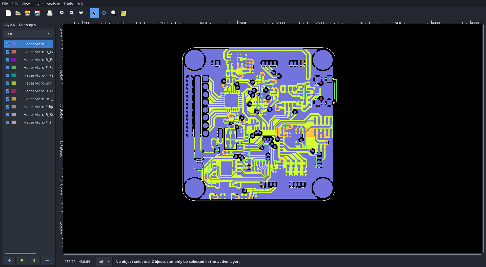
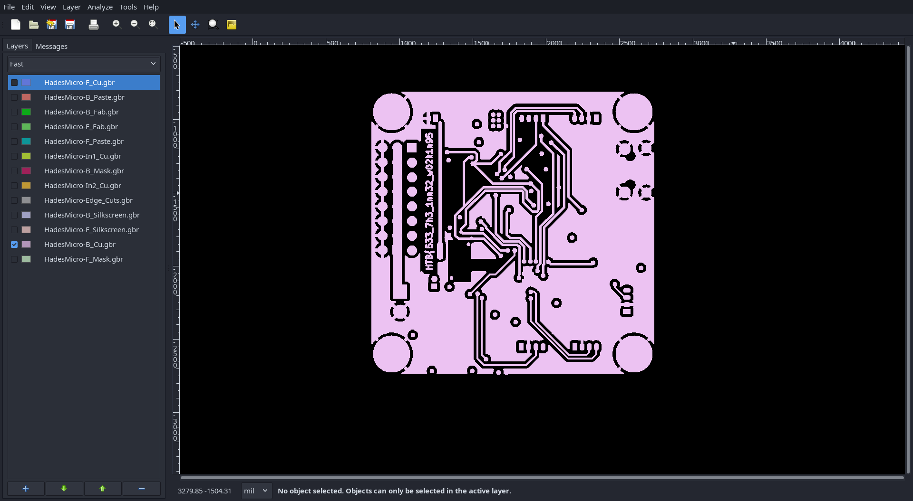
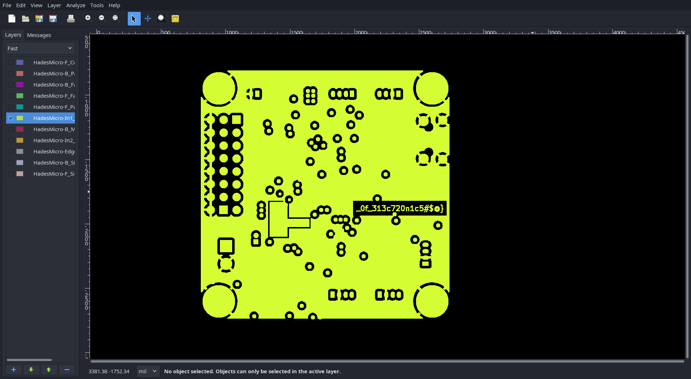

# Critical flight (very easy)
In this challenge we need to open another type of file.

After downloading the challenge files, we get a bunch of `.gbr` files.
After some additional internet browsing I find out these are called gerber files.

The `community/gerbv` package on archilnux provides the views that can open these files.

After opening the files I see the following:

Now I decided to hide/unhide layers as that was the only action I knew how to do.

After some trial and error, the following parts of the flag were revealed:

The final symbol of the second part was an `@`, which gave me a bit of a hard time, but the flag was submitted.
