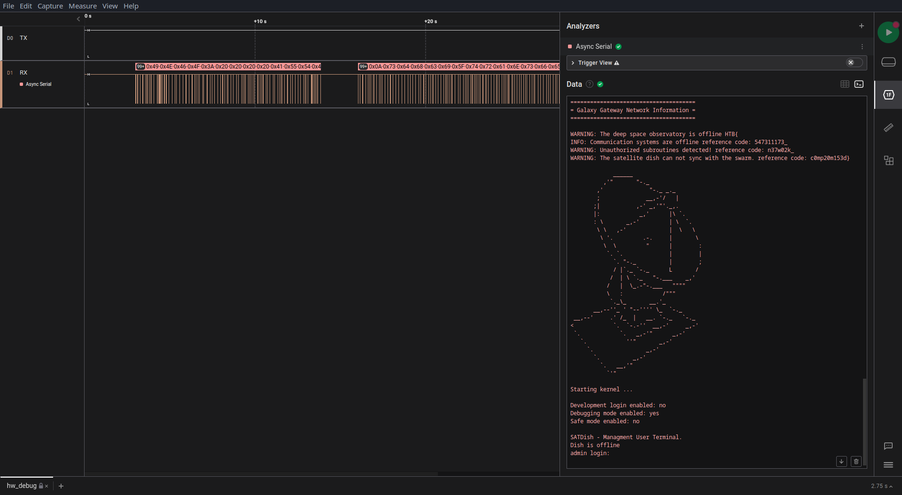

# Debug (easy)
For this challenge we will use saleae-logic2

Now we are back again with a `.sal` file, and I already have a tool to open this from the first challenge.

Now we see 2 signals RX and TX, and from me experimenting with the analyzers from the first challange I had the feeling that this might be a capture of UART communication.

And indeed the assumption is correct, using the `Async Serial` analyzer with 115200 bits/s (a common value for UART communication) I was able to decode the communication and get the flag.

