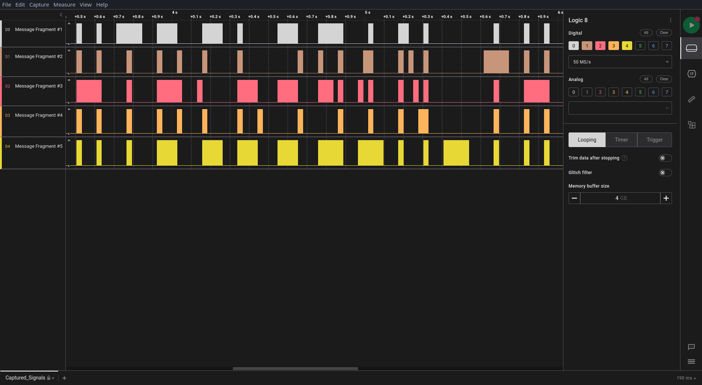

# Timed transmission (very easy)
For this challange we need to figure out how to open a `.sal` file.

Well, we get this file and some internet searching later I figure out that there's a tool called `saleae-logic2` that can open this file.

On archlinux this can be acquired from the `aur/saleae-logic2` package.

After opening the file I spent quite a bit of time trying the different analyzers, before noticing that the signals themselves form the letters of the flag.

After copying the letters to a txt file I got the flag.

Try to convince yourself that you can see the letters `HTB` in the picture above
