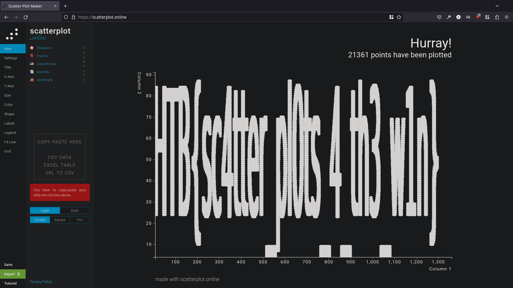

# Reconfiguration (very easy)
After downloading the files, I read a bit into the `.ows` file and saw the mention of scatter plots.

Then I though I'll load the `points.csv` file into a plot and see what happens.

